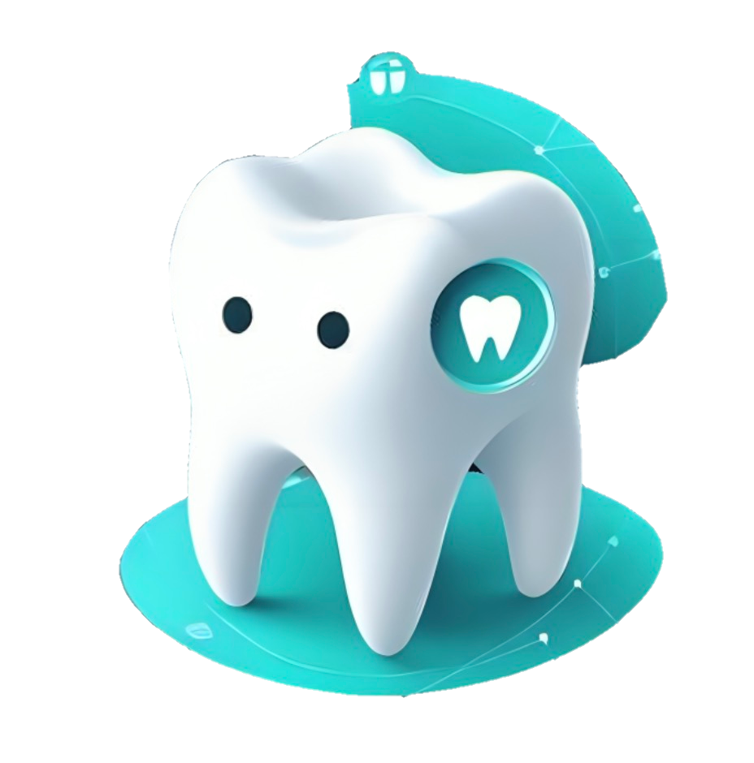

<h1 align="center">
   
    
   
    Dentiva
   
    <small style="font-size: 16px"><em>Your Dental Detective for Healthy Mouths</em></small>
</h1>

<!-- Table Of Contents -->

## Table Of Contents

- [Table Of Contents](#table-of-contents)
- [Overview](#overview)
- [Feature](#feature)
- [Dataset](#dataset)
- [Machine Learning Team](#machine-learning-team)

## Overview

In this project, the ML team will work on implementing machine learning algorithms for detecting dental and oral diseases, as well as maintaining oral health. We will develop the models using TensorFlow and may employ transfer learning to leverage existing knowledge. Our models will be deployed using TensorFlow Lite, ensuring efficient performance on mobile devices. Additionally, this application will provide recommendations for nearby dental and oral clinics, helping users find the necessary healthcare services quickly and easily.

## Feature

### 1. Disease Detection
Dentiva utilizes convolutional neural networks (CNNs) to analyze images of teeth and identify potential dental diseases. The application can detect conditions such as:

- Caries
- Tooth Discoloration
- Calculus
- Hypodontia
- Gintivis
- Mouth Ulcer
- Normal

### 2. Oral Care Guidance
Based on the detected condition, Dentiva provides personalized oral care advice, including:

- Proper brushing techniques
- Recommended dental hygiene products
- Tips for maintaining oral health
- Reminder to brush teeth

### 3. Clinic Recommendation
Using geolocation services, Dentiva can recommend nearby dental clinics, offering details such as:

- Clinic name and address
- Contact information
- Operating hours
- Patient reviews

### Recommendation System

Our Dentiva application utilizes advanced machine learning techniques to detect dental and oral diseases, maintain oral health, and recommend nearby dental clinics. The model leverages a hybrid architecture that combines image processing and textual feature analysis to deliver comprehensive solutions.

Disease Detection and Oral Health Maintenance
The application employs convolutional neural networks (CNNs) to analyze dental images and identify various oral diseases such as cavities, gum disease, and oral cancer. By utilizing pre-trained models and transfer learning, the system can accurately detect abnormalities and provide diagnostic insights. Additionally, the app offers personalized oral health maintenance tips based on user data, ensuring users receive tailored advice for optimal oral hygiene.

Clinic Recommendation System
The recommendation system in Dentiva combines collaborative filtering and textual feature analysis to suggest nearby dental clinics. The model uses user and clinic embeddings to capture collaborative signals, understanding user preferences and clinic characteristics. Textual embeddings are generated from features such as clinic descriptions, services offered, and user reviews, allowing the model to capture content-based information.

These embeddings are concatenated and processed through dense layers, learning high-level representations that incorporate both collaborative and content-based data. By integrating these diverse embeddings, the model can accurately recommend clinics based on user preferences and clinic attributes. The system is trained using binary cross-entropy loss and the Adam optimizer, optimizing its ability to predict user-clinic interactions. Textual inputs undergo tokenization and padding using the Tokenizer and pad_sequences from the Keras library, ensuring consistent input dimensions for effective training and prediction.

This hybrid approach enables Dentiva to provide accurate disease detection, personalized health tips, and relevant clinic recommendations, enhancing users' oral health and making it easier to find the necessary healthcare services.

## Dataset

### 1. Dental Disease Images (from Kaggle): 
This dataset includes images of various dental and oral diseases, which are used to train and test our disease detection model.
- [Oral Disease Dataset](https://www.kaggle.com/datasets/salmansajid05/oral-diseases) 
### 2. Healthy Teeth Images (from GitHub): 
This dataset includes images of healthy teeth, providing a baseline for comparison in the disease detection process.
- [GitHub Normal Teeth Dataset](https://github.com/PKNU-PR-ML-Lab/calculus/blob/main/normal.zip)

## Machine Learning Team

| Name                       | Student ID  | Contact                                                                                                                                                                                                                                                                                                           |
| -------------------------- | ----------- | ----------------------------------------------------------------------------------------------------------------------------------------------------------------------------------------------------------------------------------------------------------------------------------------------------------------- |
| Ridwan Rahmat | M204D4KY2343 |   |
| Putri Al Zahra         | M738D4KX2645 |                   |
| Dinda Warfani Hasbullah     | M278D4KX2592 |     |
